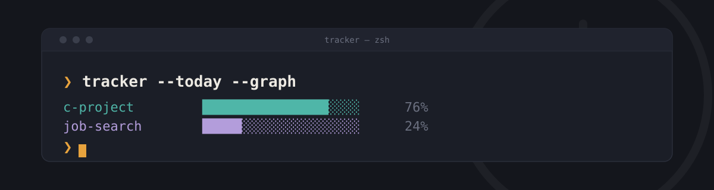

<p align="center">
  
</p>

<h1 align="center">tracker</h1>
<p align="center">A personal command-line time tracker. Start and stop sessions, tag them with a topic, and see where the time went — kept in sync across machines with Syncthing, no server involved.</p>

<p align="center">
  
  
  
  
</p>

---

## Features

-  `--start` / `--stop` track time with two commands — a session left running for hours (a sleeping laptop, most likely) asks for confirmation before it's saved
-  Topics come from a fuzzy-searchable picker, so a typo can't quietly create a duplicate
-  See where the time went as a table or a terminal bar graph, by day, week, month, or year
-  Kept in sync across two machines with Syncthing — no server, no account, no cloud
-  Fix a mistake after the fact with `--edit` or `--delete`, instead of hand-editing the database

## Install

Requires [Python 3.10+](https://www.python.org/downloads/) and [pipx](https://pipx.pypa.io/latest/how-to/install-pipx.html).

```
pipx install git+https://github.com/anirudhkottayil/tracker.git
```

## First-time setup

The database has to be created exactly once, on exactly one machine, before
it's shared with the other — doing this out of order can let both machines
create their own independent database at the same path, which Syncthing
can't merge back together.

1. On one machine only: `tracker --init`
2. Share the folder it created (`~/.local/share/tracker/db/`) in Syncthing with the other machine
3. On the second machine, accept the incoming folder and wait for it to report fully synced
4. Never run `--init` again, on either machine

## Usage

```
tracker --start                 # start a session
tracker --stop                  # stop it, and pick a topic
tracker --status                # check whether one's running

tracker --today                 # time spent today, by topic
tracker --today --list          # ...as individual sessions, with IDs
tracker --today --graph         # ...as a bar graph

tracker --edit ID               # fix a session's topic or time
tracker --delete ID             # remove a session
```

`--today` works the same way with `--yesterday`, `--week`, `--lweek`, `--month`, `--lmonth`, or `--year`.

## How it works

Every session is a timestamped row in a local SQLite database; the period
flags resolve to a date range and query it, grouped by topic. That database
lives in a folder synced across machines with Syncthing — not a hosted
service, just two machines agreeing on one file.

## Data

The database is `~/.local/share/tracker/db/tracker.db` — this is the folder
to point Syncthing at.
